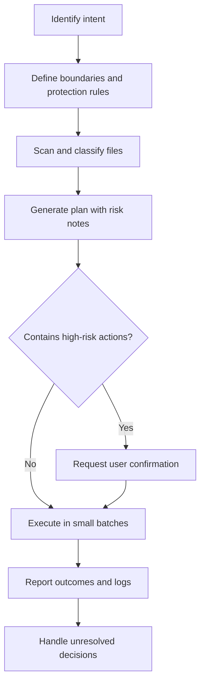

# Workspace Governance Manual (Detailed)

- Author: Mars
- Email: yangronghuang@outlook.com
- Date: 2026-04-28

## Contents

- [1. Positioning](#1-positioning)
- [2. Governance Principles](#2-governance-principles)
- [3. Scope Boundaries](#3-scope-boundaries)
- [4. Quick Start](#4-quick-start)
- [5. Execution Workflow](#5-execution-workflow)
- [6. Plan Template](#6-plan-template)
- [7. Standard Operation Modes](#7-standard-operation-modes)
- [8. Quality Checklist](#8-quality-checklist)
- [9. Safety Baseline](#9-safety-baseline)
- [10. SKILL_ADAPT Configuration](#10-skill_adapt-configuration)
- [11. Common Scenarios](#11-common-scenarios)
- [12. FAQ](#12-faq)

## 1. Positioning

`workspace-governance` is a governance framework, not a folder scaffold.  
It provides a decision model and execution guardrails so an AI agent can make safe, context-fit workspace decisions.

It works with skill/rule-based coding agents such as Claude Code, Cursor, Windsurf, OpenClaw, and Hermes Agent.

## 2. Governance Principles

- Boundary before structure
- Plan before action
- Reversible before optimized
- Fit existing conventions first
- User confirmation for destructive actions
- Evidence-based decisions from real scan results

## 3. Scope Boundaries

This skill governs workspace operations, not business logic refactoring.  
Default focus:

- Organize workspace
- Archive project
- Create project boundaries
- Run hygiene checks

Out of default scope:

- Direct deletion of high-risk files
- Overwriting on name collisions
- Touching VCS metadata
- Handling sensitive credentials without explicit approval

## 4. Quick Start

### 1) Install the skill file

```bash
# Claude Code (global)
mkdir -p ~/.claude/skills/workspace-governance
cp SKILL.md ~/.claude/skills/workspace-governance/

# Cursor (project-level)
mkdir -p .cursor/skills/workspace-governance
cp SKILL.md .cursor/skills/workspace-governance/
```

### 2) Add project-level adaptation config

This repository includes `SKILL_ADAPT.yaml`.  
Keep it beside `SKILL.md` so the agent can read project preferences before execution.

### 3) Trigger with natural language

- "organize workspace"
- "audit first, then cleanup"
- "archive project xxx"
- "create project yyy with boundaries"

## 5. Execution Workflow



Phases:

1. Identify intent: organize / archive / create / audit.
2. Define boundaries: `workspace_root`, `immutable_dirs`, `protected_files`.
3. Classify findings: keep/move/rename/archive/delete/ask-user.
4. Output plan with reason, target, and risk.
5. Confirm delete and bulk move actions.
6. Execute incrementally in batches.
7. Record outcomes, failures, and pending decisions.

## 6. Plan Template

| Item | Current | Proposed Action | Target | Risk | Reason |
|------|---------|-----------------|--------|------|--------|
| example.tmp | root | delete | — | medium | temporary artifact |
| report-final.docx | root | ask-user | docs or archive | low | destination ambiguous |

## 7. Standard Operation Modes

### 1) Organize

Goal: improve discoverability with minimum disturbance.

### 2) Create Project

Goal: initialize clear boundaries and lifecycle rules aligned with current conventions.

### 3) Archive Project

Goal: move inactive work to retrievable cold storage with metadata and rollback clues.

### 4) Hygiene Check

Goal: output quality signals and fix suggestions without default destructive actions.

## 8. Quality Checklist

- Boundary clarity (managed vs protected)
- Root clutter level
- Naming consistency
- Cache/build residue policy
- Archive recoverability
- Traceability of planned vs executed actions

## 9. Safety Baseline

Never touch by default (unless explicitly approved):

- VCS metadata: `.git/`, `.svn/`, `.hg/`
- Secret material: `*.key`, `*.pem`, `*.p12`, private credentials
- Environment files: `.env` and equivalents
- Agent/runtime configuration directories

Destructive guardrails:

- Always provide dry-run plan first
- Require explicit confirmation for delete and bulk move
- Never overwrite on collision
- Stop and ask when high-risk patterns are detected

## 10. SKILL_ADAPT Configuration

`SKILL_ADAPT.yaml` defines project-level governance preferences.

Key fields:

- `workspace_root`: operation boundary root
- `immutable_dirs`: never move/delete/rename directories
- `protected_files`: sensitive file patterns
- `cache_policy`: separate or consolidate cache handling
- `naming_policy`: inherit or enforce naming policy
- `destructive_guard`: confirmation thresholds for risky actions
- `execution`: batch size and ambiguous-item handling
- `logging`: log switch, file path, output fields

If strict standardization is needed, set `naming_policy: enforce` and provide explicit naming rules.

## 11. Common Scenarios

### Scenario A: Workspace is messy

- Run hygiene check first
- Generate governance plan
- Execute after user confirmation

### Scenario B: Project closure and archive

- Confirm archive scope and retention window
- Generate archive list and targets
- Execute and report summary

### Scenario C: Multi-project parallel development

- Define isolated boundaries per project
- Separate shared assets from project assets
- Use unified logs for governance traceability

## 12. FAQ

**Q1: Does this skill force a fixed directory layout?**  
No. Default behavior is "inherit existing conventions + minimum disturbance."

**Q2: Can it auto-delete temporary files in one shot?**  
Yes, but dry-run and explicit confirmation are still recommended.

**Q3: Is it suitable for all agents?**  
It is suitable for agents that support skill/rule files and basic Unix shell operations.

## 13. Execution Dependencies and Non-Interactive Policy (New)

### Required capabilities and preconditions

- File/dir operations (scan, move, rename, archive, delete)
- Logging capability (file sink or structured output)
- User confirmation capability for destructive and ambiguous actions
- `workspace_root` must be defined before execution

### `SKILL_ADAPT` integration requirements

- If `SKILL_ADAPT.yaml` exists, it must be loaded before planning
- Precedence: user explicit instruction > `SKILL_ADAPT` > repository conventions > conservative defaults
- Parse failures must not be silently ignored; fallback + warning log are required

### Non-interactive safety policy

For cron/background/execute-only runtimes:

- Any `ask-user` item must stop execution with `blocked` status
- A `pending_decisions` list must be emitted
- Silent skip, auto-approval, and auto-delete on ambiguous items are forbidden
- If confirmation capability is unavailable, destructive actions must fail fast

### Minimum rollback/checkpoint schema

- Pre-checkpoint: `checkpoint_before`
- Per-batch checkpoint: `checkpoint_batch_<n>`
- Post-checkpoint: `checkpoint_after`

Recommended minimum log fields:

- `timestamp`, `intent`, `batch_id`, `action`
- `source_path`, `target_path`
- `result` (success/failure/blocked)
- `reversible`, `rollback_ref`
