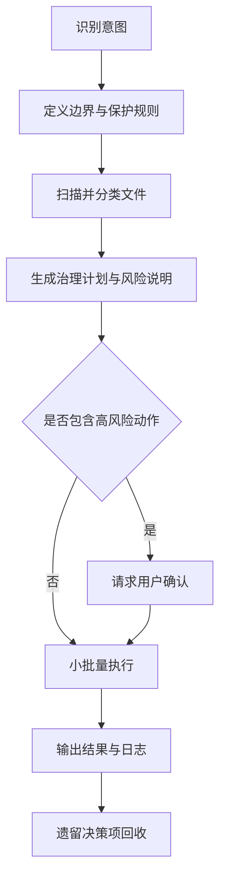

# 工作区治理手册（详细版）

- 作者: Mars
- 邮箱: yangronghuang@outlook.com
- 日期: 2026-04-28

## 目录

- [一、项目定位](#一项目定位)
- [二、治理原则](#二治理原则)
- [三、能力边界](#三能力边界)
- [四、快速开始](#四快速开始)
- [五、执行工作流](#五执行工作流)
- [六、治理计划模板](#六治理计划模板)
- [七、标准操作模式](#七标准操作模式)
- [八、质量检查清单](#八质量检查清单)
- [九、安全与风控基线](#九安全与风控基线)
- [十、SKILL_ADAPT 配置说明](#十skill_adapt-配置说明)
- [十一、常见落地场景](#十一常见落地场景)
- [十二、FAQ](#十二faq)

## 一、项目定位

`workspace-governance` 不是目录模板，不提供一刀切脚手架。  
它提供的是一套“决策框架 + 执行守则”，让 AI Agent 能在不同环境中做出稳妥治理决策。

适用于任何支持 skill/rule 的 AI 编码助手，例如 Claude Code、Cursor、Windsurf、OpenClaw、Hermes Agent。

## 二、治理原则

- 先边界，后结构：先定义可操作范围，再谈目录优化。
- 先方案，后执行：先出计划，再做文件动作。
- 可逆优先：优先选择可回滚方案，避免不可逆操作。
- 贴合现状优先：先复用当前项目约定，再考虑标准化。
- 用户控制关键决策：删除、批量移动、歧义项必须确认。
- 证据驱动：只基于真实扫描结果做决策，不凭猜测。

## 三、能力边界

该技能的职责是“治理流程”，不是“业务代码改造”。默认关注以下任务：

- 工作区整理（Organize）
- 项目归档（Archive Project）
- 新项目治理边界初始化（Create Project）
- 工作区健康检查（Hygiene Check）

不默认执行：

- 直接删除高风险文件
- 覆盖同名文件
- 修改版本控制元数据
- 处理密钥/证书/环境变量等敏感内容

## 四、快速开始

### 1) 安装技能文件

```bash
# Claude Code（全局）
mkdir -p ~/.claude/skills/workspace-governance
cp SKILL.md ~/.claude/skills/workspace-governance/

# Cursor（项目级）
mkdir -p .cursor/skills/workspace-governance
cp SKILL.md .cursor/skills/workspace-governance/
```

### 2) 放置适配配置

当前仓库已提供项目级配置：`SKILL_ADAPT.yaml`。  
建议与 `SKILL.md` 一起保留在项目根目录，供 Agent 在执行前读取。

### 3) 用自然语言触发

- “整理工作区”
- “先做审计再清理”
- “归档项目 xxx”
- “创建项目 yyy 并设置治理边界”

## 五、执行工作流



### 分阶段说明

1. 识别意图：明确是 organize / archive / create / audit。
2. 定义边界：确认 `workspace_root`、`immutable_dirs`、`protected_files`。
3. 扫描分类：keep/move/rename/archive/delete/ask-user。
4. 计划输出：包含动作、原因、风险、目标和回滚提示。
5. 风险拦截：删除与批量移动强制二次确认。
6. 分批执行：避免一次性大规模改动。
7. 结果沉淀：记录执行摘要、失败原因、待确认项。

## 六、治理计划模板

执行前建议输出：

| 项目 | 当前状态 | 建议动作 | 目标位置 | 风险 | 原因 |
|------|----------|----------|----------|------|------|
| example.tmp | root | delete | — | 中 | 临时产物 |
| report-final.docx | root | ask-user | docs 或 archive | 低 | 目标归属不明确 |

## 七、标准操作模式

### 1) Organize（整理）

目标：以最小扰动提升可发现性，降低根目录杂乱度。

### 2) Create Project（新建项目）

目标：在保留现有组织习惯前提下，创建清晰的管理边界与生命周期规则。

### 3) Archive Project（项目归档）

目标：将低活跃项目转入可检索冷存储，并保留必要元信息和回滚线索。

### 4) Hygiene Check（健康检查）

目标：基于质量信号产出风险清单和修复建议，不默认执行破坏动作。

## 八、质量检查清单

- 边界是否清晰（可管理 vs 受保护）
- 根目录是否存在持续堆积
- 命名是否一致且可检索
- 缓存/构建残留是否有治理策略
- 归档是否具备可恢复路径
- 日志是否可追溯（计划 vs 实际）

## 九、安全与风控基线

默认“禁止触碰”范围（除非用户明确批准）：

- 版本控制元数据：`.git/`、`.svn/`、`.hg/`
- 敏感材料：`*.key`、`*.pem`、`*.p12`、私有凭据
- 环境变量文件：`.env` 及等价文件
- Agent/运行时配置目录

破坏性动作守则：

- 必须先 dry-run 计划
- 删除与批量移动必须显式确认
- 同名冲突禁止覆盖
- 发现异常高风险模式立即暂停并询问用户

## 十、SKILL_ADAPT 配置说明

本仓库新增了 `SKILL_ADAPT.yaml`，用于声明项目级治理偏好。

主要字段说明：

- `workspace_root`：治理边界根路径（默认 `.`）
- `immutable_dirs`：不可移动/删除/重命名目录
- `protected_files`：敏感文件匹配规则
- `cache_policy`：缓存策略（分离/合并）
- `naming_policy`：命名策略（继承现状/强制统一）
- `destructive_guard`：破坏性动作的确认门槛
- `execution`：执行批大小、歧义项处理策略
- `logging`：日志开关、路径和字段

如需更强标准化，可把 `naming_policy` 调整为 `enforce`，并补充命名规则文档。

## 十一、常见落地场景

### 场景 A：工作区太乱

- 先跑 `Hygiene Check`
- 再输出治理计划
- 用户确认后按批次整理

### 场景 B：项目收尾归档

- 确认归档范围与保留周期
- 生成归档清单和目标路径
- 执行并输出归档摘要

### 场景 C：多项目并行开发

- 为每个项目定义独立边界
- 共享资源和项目资源分层管理
- 统一使用日志沉淀治理记录

## 十二、FAQ

**Q1：这个技能会强制我改目录结构吗？**  
不会。默认策略是“继承现状 + 最小扰动”。

**Q2：能不能一键自动删临时文件？**  
可以，但仍建议先出 dry-run；删除动作需显式确认。

**Q3：适合所有 Agent 吗？**  
适合支持 skill/rule 文件的 Agent；执行命令依赖基础 Unix shell 能力。
